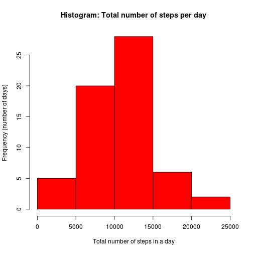

# Reproducible Research: Peer Assessment 1


## Loading and preprocessing the data

Load the data into R. Making sure that the **header=T** option is specified to make sure that the column headings are imported properly, meaning that the structure of the entire imported dataset is intact.


```r
data <- read.csv("activity.csv", header = T)
```


Summarise the data by the sum, mean and median of the number of steps measured on each day: 

I may want to set ***cache=TRUE*** or cache.vars=TRUE at some stage


```r
library(plyr)
dailySummaryStats <- ddply(data, .(date), summarize, sum.steps = sum(steps, 
    na.rm = T), mean.steps = mean(steps, na.rm = T), median.steps = median(steps, 
    na.rm = T))
```


## What is mean total number of steps taken per day?

<explain how you made the histogram>

Histogram of the total number of steps measured per day:

```r

hist(dailySummaryStats$sum.steps, main = "Histogram: Total number of steps per day", 
    xlab = "Total number of steps in a day", ylab = "Frequency (number of days)")
```

 

```r

meanSteps <- mean(dailySummaryStats$sum.steps)
medianSteps <- median(dailySummaryStats$sum.steps)
```


The _mean_ number of steps is: **9354.2295**.
The _median_ number of steps is: **10395**.


## What is the average daily activity pattern?

I think that this is where we plot


```r
library(ggplot2)
qplot(dailySummaryStats$date, dailySummaryStats$mean.steps, type = "l", main = "Graph of average daily activity pattern", 
    xlab = "Date", ylab = "Average (number of steps)")
```

```
## Warning: Removed 8 rows containing missing values (geom_point).
```

 

```r
lines(dailySummaryStats$date, dailySummaryStats$mean.steps, type = l, col = "red")
```

```
## Error: object 'l' not found
```


the above plot is cute... but wrong!

or are we supposed to split the data by interval? (probaly not)


```r
library(plyr)
intervalSummaryStats <- ddply(data, .(interval), summarize, sum.steps = sum(steps, 
    na.rm = T), mean.interval.steps = mean(steps, na.rm = T), )
```

```
## Error: argument is missing, with no default
```


## Imputing missing values


```r
missingSteps <- length(data$steps[is.na(data$steps)])
```


The total number of missing values is: **2304**.

***<span style="color:red">I have changed this!!</span>***  
After some consideration, I felt that the simplest way to impute missing values into the data was to replace the NA values with 0. This is based in the simple assumptin that where the data could not be measured/obtained (i.e. was ***NA***), this was because there was no activity to be measured (i.e. the number of steps take were ***zero***). Such a situation may arise in scenario such as when the subject is in the act, sitting, standing still, lying down or traveling in a vehicle. 

Side note: Alternatively, I could take the mean of the "steps" column in the raw data. Which would average out the number of steps taken in each interval of every day. But this may assume constant motion on the part of the subject at all times, not so feasible.


```r
# 'copy' the source data frame called 'data' into one called 'imputedData'
imputedData <- data
# find all NA values in imputedData and replace them with 0

# (33, representing a low activity day) ==> generated from running summary()
# this is the value from calling summary() on the original data set. i.e.
# summary(data)

imputedData[is.na(imputedData)] <- 33

# make a summary of the data via the method used earlier
library(plyr)
imputedDailySummaryStats <- ddply(imputedData, .(date), summarize, sum.steps = sum(steps, 
    na.rm = T), mean.interval.steps = mean(steps, na.rm = T))
# plot the data
hist(imputedDailySummaryStats$sum.steps, col = "red", main = "Histogram: Total number of steps per day", 
    xlab = "Total number of steps in a day", ylab = "Frequency (number of days)")
```

 

```r

imputedMeanSteps <- mean(imputedDailySummaryStats$sum.steps)
imputedMedianSteps <- median(imputedDailySummaryStats$sum.steps)
```

Temp note: try running something like format to make the printing tidy

In the imputed data:  
1. The _mean_ number of steps is: **1.0601 &times; 10<sup>4</sup>**.  
2. The _median_ number of steps is: **1.0395 &times; 10<sup>4</sup>**.  

In the data summary of the date generated before the imputation:  
1. The _mean_ number of steps is: **9354.2295**.  
2. The _median_ number of steps is: **10395**.  

Comparatively:
1. The imputed mean values are **1.1332** higher than the previously calculated mean.  
2. The imputed mean values are **1** higher than the previously calculated mean.  

This make sense because These results are not different because the operations required to make the **dailySummaryStats** object was created by 

## Are there differences in activity patterns between weekdays and weekends?


not sure yet?
